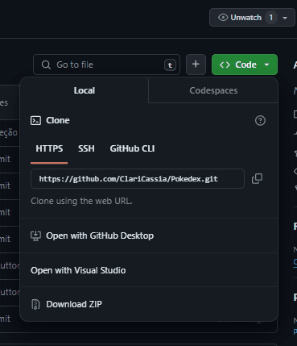

<p align="center">
  
</p>

<p align="center" fontSize="60px">
  Desafio React-Avançado
</p>

<p align="center">
  
</p>

## 💻 Projeto

O propósito da aplicação é fornecer uma interface simples para visualizar uma lista de Pokémon, exibindo inicialmente 10 cards com detalhes básicos de cada Pokémon. Ao clicar em um card, o usuário é direcionado para uma página detalhada com informações mais específicas do Pokémon selecionado. Além disso, há um botão de "Carregar Mais" que adiciona mais 10 Pokémon à lista existente. Para ver o projeto pronto [clique aqui ](https://clari-cassia-projetcs-colecao-de-repositorios.vercel.app/)🚀

 

### Funcionalidades

 **Listagem dos pokémons**: Listar os pokémons com o uso da API REST [PokéApi](https://pokeapi.co/).

**Ampliar a listagem dos pokémons**: Adicionar mais pokémons a lista, ampliando-se a quantia de pokémons mostrada ao usuário ao clicar no botão carregar mais.

**Possibilidade de alterar o Tema**: Botão de mudança de tema claro e escuro

 **Buscar pokémons**: Filtrar os pokémons a partir do seu tipo.

 **Selecionar pokémon**: Página na aplicação com mais detalhes sobre o pokémon escolhido.

**Exibir seções de detalhes dos pokémons**: Nome, Grupos de ovos,Tipo, Genêro, Movimentos, Habilidades, Fraquezas, Linha de Evolução.


## Ferramentas Utilizadas

-  [React](https://pt-br.reactjs.org/) (utilizando,  [create-vite](https://vitejs.dev/guide/))
-  [Styled-components](https://www.styled-components.com/)

-  [Single Page Application  ](https://www.devmedia.com.br/react-spa-entendendo-o-conceito-de-uma-single-page-application/43490)

-  [Axios](https://github.com/axios/axios)

-  [React-Icons](https://react-icons.netlify.com/)

-  [React Router](https://reactrouter.com/web/guides/quick-start)

-  [Context API ](https://pt-br.legacy.reactjs.org/docs/context.html)


##  Decisões Adotadas
Passo a Passo para a Criação do Desafio:

 **1. Criação da estrutura react:** Comecei criando a estrutura básica do projeto React, optei pelo uso do Vite para manter tudo organizado. Também fiz uma limpeza nos arquivos, excluindo tudo o que não iría utilizar.

**2. Página Inicial: Trabalhando com a API do Pokedex:** 
Utilizando o Axios, fizemos a chamada para a API do Pokedex, trazendo todos e separando as informações necessárias.

**3. Implementação do Context API e Botão de Tema:** Para dar um toque especial criei um botão de troca de tema, inspirado no Sol e na Lua.
Utilizei o Context API para gerenciar o tema de toda a aplicação.
Garanti que o botão de tema soubesse exatamente o que exibir ao passar as informações do contexto, incluindo até a sombra dos cards.

**4. Aplicar Tema aos Componentes:** Com o botão de tema pronto, foi hora de estender essa personalização para todos os componentes da aplicação.
Assim, garantimos que cada detalhe se adaptasse ao tema escolhido pelos usuários.

**5. Criação do Botão "Carregar Mais":** Adicionei um botão "Carregar Mais" onde os nossos usuários tem a chance de explorar ainda mais o mundo Pokémon, então 
implementei a lógica que permite exibir mais 10 pokemons quando o botão é clicado.

 **6. Implementação de Rotas:** Para facilitar a navegação, criei rotas para diferentes páginas, como a página inicial e os detalhes de cada Pokémon.

**7. Página de Detalhamento::** Criei todos os arquivos e serviços necessários para trazer os detalhes únicos de cada Pokémon.
Assim, os usuários podem mergulhar fundo nas informações de seus Pokémon favoritos em uma página especialmente dedicada a eles.

**8. Implementação do Filtro:** Com as funcionalidades principais prontas, decidi topar o desafio de adicionar um componente de filtro.
Implementei a lógica que filtra os Pokémon conforme o tipo selecionado pelos usuários, para uma busca mais precisa.

**9. Estilização com Componentes:** Durante todo o desenvolvimento, fui trabalhando na estilização dos componentes para criar uma interface bonita e amigável.
Meu objetivo foi sempre garantir que as informações fossem apresentadas de forma clara e agradável para uma experiência incrível.
Com todos esses passos, consegui criar uma aplicação React completa, recheada de funcionalidades sempre me atentando a  testar em diversos cenários para uma experiência de usuário sempre fluida e agradável, tanto em desktop quanto em mobile.


Espero que esse passo a passo seja útil para vocês também, e que se divirtam explorando o mundo Pokémon 

 ## 📥 Passo a Passo  para instalação e execução

 **Pré-requisitos:**
   - Vs Code 
   -  Node.js instalado (Para que o projeto rode localmente, será necessário ter o  com VSCode instalado.)
   - Git Bash - Ferramenta de versionamento
   - Npm ou Yarn - Controle de pacotes

 **1. Clone o Repositório:**
   Dentro da pasta onde deseja salvar o projeto, abra o git e efetuar o comando
   ```bash
   git clone https://github.com/ClariCassia/Pokedex.git
   
   ```
   - É possível também baixar o arquivo e desconpactar localmente:  
   

 **2. Acesse o Diretório:**
   ```bash
   cd nome-do-projeto
   ```

 **3. Instale as Dependências:**

   ```bash
   npm install   # ou yarn install, conforme sua prefêrencia
   ```

 **4. Execute a Aplicação:**
   ```bash
   npm start   # ou yarn start
   ```

 **5. Acesse a Aplicação:**
   Abra o navegador e acesse [http://localhost:5173/](http://localhost:5173/).

## Contribuições


Se quiser contribuir para este projeto, siga estes passos:

Faça o `fork` e clone o projeto a partir do seu usuário.

```bash
# Clonando projeto
$ git clone https://github.com/SEU-NOME-DE-USUARIO/pokedex.git

# Criando um branch
$ git branch minha-alteracao

# Acessando o novo branch
$ git checkout -b minha-alteracao

# Adicionando os arquivos alterados
$ git add .

# Criando commit e a mensagem
$ git commit -m "Add nova funcionalidade"

# Enviando alterações para o brach
$ git push origin minha-alteracao
```
Você deve navegar até o seu repositório onde fez o fork e clicar no botão *New pull request* no lado esquerdo da página.

###  Agradeço antecipadamente pela sua contribuição, juntos podemos tornar este projeto ainda mais incrível! 🙏🌟
Com ❤️ por [Clarissa de Cássia](https://www.linkedin.com/in/clarissa-cassia-dev-front-end/) 😊


